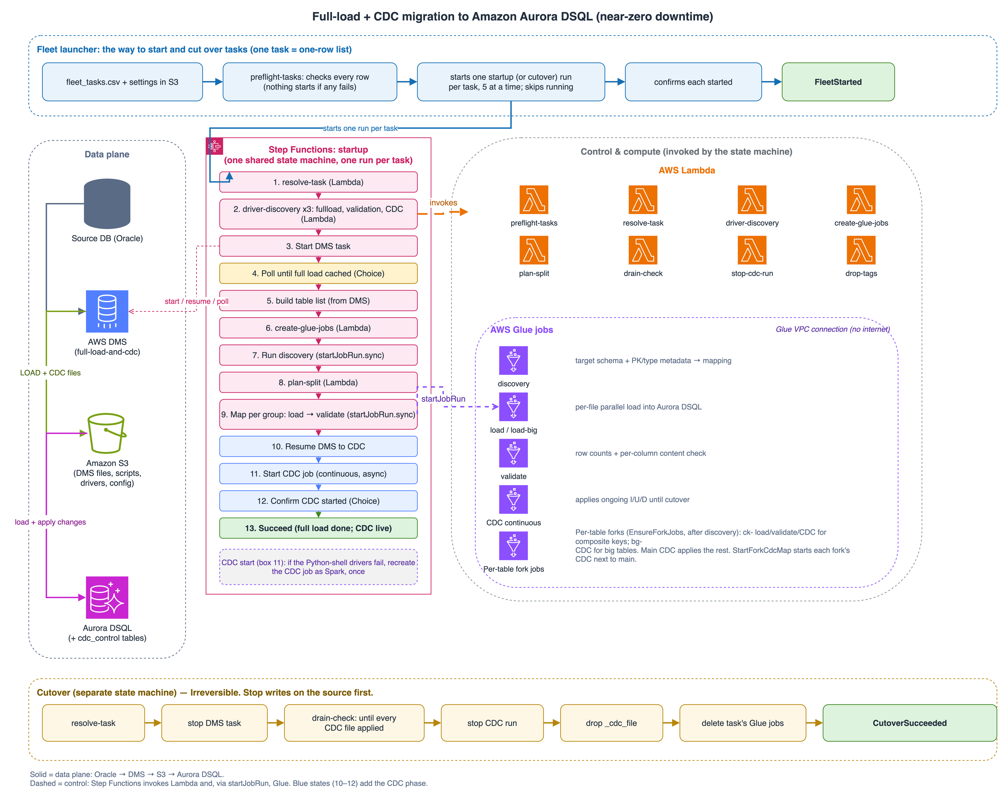

# Relational Database Migration to Amazon Aurora DSQL — with Near-Zero Downtime

A schema-agnostic pipeline that migrates relational data (validated against Oracle sources) into
**Amazon Aurora DSQL** with a **full load → validate → continuous CDC → cutover** flow, so the
application keeps running against the source until you are ready to switch over.

**AWS DMS** extracts to Amazon S3 as CSV, **AWS Glue** loads, validates and continuously applies the
changes into Aurora DSQL, and **AWS Step Functions** runs each migration task end to end. You stop
writes to the source only at cutover, once CDC has caught up and the target matches the source.



> **To deploy and run the pipeline, follow [`RUNBOOK.md`](RUNBOOK.md).** This page explains what the
> pipeline is and how it behaves; the RUNBOOK has every command, in order.

## How it works

The **fleet** is the only way to start and cut over tasks. You launch `fleet-startup` (and later
`fleet-cutover`) once, by hand, with `{"bucket": "<bucket>"}`; it reads
`s3://<bucket>/config/fleet_tasks.csv` and runs the per-task **startup** (or **cutover**) state
machine for each row. Operator files always live in the fixed folder `s3://<bucket>/config/`
(`params.csv`, `fleet_tasks.csv`, `pipeline.json`). **One DMS task is one row in
`config/fleet_tasks.csv`**; a new wave is just a new `config/fleet_tasks.csv` and another trigger.

For each task, startup then:

1. **Preflight / resolve** — checks `config/pipeline.json` and the DMS task *before* starting DMS
   (type `full-load-and-cdc`, `StopTaskCachedChangesApplied=true`, `AddColumnName=true`, target =
   your pipeline bucket, same region, not past its full load).
2. **Drivers** — checks the Glue driver wheels and prepares the Python-3.9 CDC wheels.
3. **DMS full load** — starts DMS and waits for `STOPPED_AFTER_CACHED_EVENTS`.
4. **Build the table list** automatically from the DMS task (nothing to upload).
5. **Glue jobs** — discovery (read the DSQL schema + PK/type metadata), load (Spark reads, pg8000
   writes), validate (row counts + every column's content).
6. **Resume DMS into CDC** and start the long-running CDC job (inserts/updates/deletes applied to
   DSQL, crash-safe through the `cdc_control` tables).

**Cutover** (`fleet-cutover`) then stops DMS, drains the last CDC files, stops the CDC job, drops the
internal `_cdc_file` column, and deletes the task's five Glue jobs — per task, irreversibly.

Settings shared by all tasks live in one file, `s3://<bucket>/config/pipeline.json`; the fleet reads
it (never writes it). `tools/setup.sh` builds it from a single `config/params.csv`. See
[`docs/FLEET_LAUNCHER.md`](docs/FLEET_LAUNCHER.md) for the fleet's inputs, preflight, skips and
results.

## Quick start

**Where things live:** your **local clone** of this repo is the code (`iam/`, `lambdas/`, `scripts/`,
`glue-templates/`, `stepfunctions/`, `tools/`); **one S3 bucket** holds what the pipeline reads at run
time (scripts, templates, driver wheels, `config/pipeline.json`, `config/params.csv`,
`config/fleet_tasks.csv`, and the DMS output CSVs); setup creates the **AWS resources** (3 IAM roles,
8 Lambdas, 4 state machines). The DMS S3 target endpoint must write to that same bucket. If your IAM
team already owns the three roles, set `manage_iam=false` (plus `lambda_role_arn` / `sfn_role_arn` /
`glue_role_arn`) and setup **uses** those roles instead of creating any — see
[RUNBOOK §4](RUNBOOK.md#using-roles-your-iam-team-already-created-manage_iamfalse).

1. **Clone the repo** and `cd` into it (run everything from this folder):
   ```bash
   git clone https://github.com/newcoder52/Relational_database_migration_to_Aurora_DSQL_with_Near_Zero_Downtime.git
   cd Relational_database_migration_to_Aurora_DSQL_with_Near_Zero_Downtime
   ```
2. **Prepare AWS:** an S3 bucket (create one if needed), an Aurora DSQL cluster with the **target
   tables** created, and a `full-load-and-cdc` DMS task per source whose S3 target endpoint writes to
   that **same bucket** ([RUNBOOK §1](RUNBOOK.md#2-what-you-need)).
3. **Fill in `params.csv`:** copy `config/params.example.csv` to `params.csv`, set `account_id`,
   `region`, `project`, `dsql_endpoint` (plus any optional keys), and upload it to the one location
   `s3://<bucket>/config/params.csv` ([RUNBOOK §2](RUNBOOK.md#3-fill-in-paramscsv)).
4. **Run setup from the repo root** (dry-run first): `tools/setup.sh s3://<bucket>/config/params.csv --with-drivers`
   — it builds the 3 IAM roles, 8 Lambdas, 4 state machines, uploads the scripts/templates/drivers,
   and publishes `config/pipeline.json` ([RUNBOOK §3](RUNBOOK.md#4-set-up)).
5. **Run tasks:** write `fleet_tasks.csv` (one row per DMS task), upload it to
   `s3://<bucket>/config/fleet_tasks.csv`, and trigger `fleet-startup`; watch each per-task execution
   ([RUNBOOK §4–§5](RUNBOOK.md#5-run-tasks-with-the-fleet)).
6. **Cut over:** when CDC has caught up, stop writes to the source and trigger `fleet-cutover`
   ([RUNBOOK §6](RUNBOOK.md#7-cut-over-with-the-fleet)).

> **If Glue has no internet:** it needs a route to DSQL (a DSQL VPC endpoint). Use the console
> cluster endpoint for `dsql_endpoint` either way — the pipeline picks the reachable hostname
> automatically. See [RUNBOOK §1](RUNBOOK.md#2-what-you-need).

## Limitations

- **DSQL schemas:** at most 10 per database (not adjustable); the CDC job adds `cdc_control`, so keep
  ≤ 9 of your own. The fleet preflight enforces it per task.
- **Per-table fork CDC jobs.** After discovery, each table is assigned exactly one CDC owner,
  recorded in the per-task registry `config/_task/<task>/_jobs.json` (`cdcOwners`):
  - **Composite (multi-column) primary keys** get their own `ck` fork — a dedicated load, validate
    and CDC job (`<project>-<task>-ck-<slug>-{load,validate,cdc}`, CDC script
    `scripts/glue_cdc_composite.py`), scoped to that one table.
  - **Big single-/no-PK tables** (FullLoadRows ≥ the big-table threshold — default **6,000,000
    rows or 8+ part-files**, both now `params.csv` settings; see
    [RUNBOOK §10 Tuning big tables and fan-out](RUNBOOK.md#tuning-big-tables-and-fan-out)) get
    their own `bg` CDC job (`<project>-<task>-bg-<slug>-cdc`, main CDC script); their load and
    validate stay on the shared `load-big` + `validate` jobs.
  - The **main CDC job** applies the remaining small single-/no-PK tables.
  Every table is loaded, validated and CDC-applied by **exactly one** job. Startup creates/updates
  the fork jobs (idempotent), recreates any missing one, and reports stale ones; cutover stops every
  CDC run (main + all forks) and deletes all of the task's jobs. Jobs are always found by their
  exact tags (`dsql_pipeline_project`/`_task`/`_fork`) + the registry — never by name prefix.
  Caps (params.csv): `max_composite_forks` (default 8; a task with more composite tables fails early,
  naming them) and `max_big_cdc_forks` (default 8; big tables past the cap stay on the main CDC job
  with a warning). Watch the Glue concurrent-job-run quota (~30/account) and DSQL connections
  (10,000/cluster) as the number of always-on CDC jobs grows. A task with no composite and no big
  tables gets no fork jobs.
- **Tables without a primary key:** inserts and deletes are applied; **updates are skipped and
  logged** to `cdc_control.cdc_skipped_ops`, unless you declare a stable logical key.
- **Schema changes during CDC:** `ADD COLUMN` and `RENAME COLUMN` are handled automatically (rename
  needs the DMS API reachable from the CDC job); **`DROP COLUMN`** blocks the table until you fix it;
  **`CHANGE DATA TYPE`** isn't detected. Every DDL must be followed by DML.
- **NULL marker:** only an empty field or the DMS endpoint's `CsvNullValue` (default `NULL`) is
  stored as NULL; `NA`, `NONE`, `N/A` are stored as text. Don't change `CsvNullValue` mid-migration.
- **Validation** compares per-range summaries, not individual rows.
- **CDC Glue runs stop after 7 days** (the Glue maximum) — restart by hand, or cut over before 7 days.
- **A DMS task can be loaded only once:** a clean-slate reload needs a new DMS task (new name → new
  folder).
- Applied CDC files are **copied** to `<table>/processed/` (originals are kept, so S3 use grows).

Details are in [`ENGINEERING_RECORD.md`](ENGINEERING_RECORD.md) and
[`CDC_EDGE_CASE_RESULTS.md`](CDC_EDGE_CASE_RESULTS.md).

## Repository layout

```
scripts/              The 4 Glue job scripts (job1_discovery, job2_load,
                      job3_validate, glue_cdc_continuous)
lambdas/              The 8 orchestration Lambdas (resolve_task, driver_discovery,
                      plan_split, create_glue_jobs, stop_cdc_run, drain_check, drop_tags,
                      preflight_tasks), plus prepare_cdc_wheels.py (used by driver_discovery)
                      and params_csv.py (the shared params.csv parser)
stepfunctions/        startup + cutover per-task state machines, and the
                      fleet-startup / fleet-cutover launchers that drive them
glue-templates/       The 8 Glue job templates (discovery, load, load-big, validate, cdc, cdc-spark, cdc-composite, cdc-composite-spark)
iam/                  The 3 combined role files (glue.json, lambda.json, stepfunctions.json)
config/               pipeline.example.json, params.example.csv, fleet_tasks.example.csv
tools/                setup.sh (one-command setup from params.csv),
                      switch_cdc_engine.py (switch a CDC job Python shell <-> Spark by hand)
RUNBOOK.md            Step-by-step deploy and operate guide
USAGE_GUIDE.md        Day-to-day operation, monitoring, manual runs
ENGINEERING_RECORD.md Architecture, bugs found and fixed, DDL support matrix
CDC_EDGE_CASE_RESULTS.md  CDC edge cases and data-type limitations
docs/
  MANUAL_SETUP.md     The setup commands by hand (if you can't run tools/setup.sh)
  FLEET_LAUNCHER.md   How the fleet works (inputs, preflight, skips, results)
  NO_PK_CDC_UPDATE_TRACKING.md  Design note: CDC for tables without a primary key
  architecture.png    Architecture diagram (full load + CDC)
  FullLoad_CDC_oracle-DSQL.drawio  Editable draw.io source for the diagram
```

## Security

No credentials or account-specific values are committed. You supply your own bucket, cluster
endpoint, schema and role ARNs through `config/params.csv` (which builds `config/pipeline.json`). The
IAM policies in `iam/` are least-privilege templates scoped to your project prefix and bucket. DSQL
authentication uses short-lived IAM tokens generated at run time — no stored passwords.

## License

Licensed under the [MIT-0 License](LICENSE).
